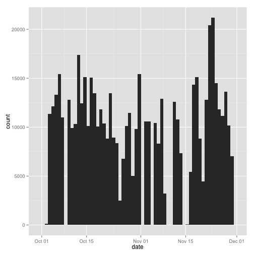
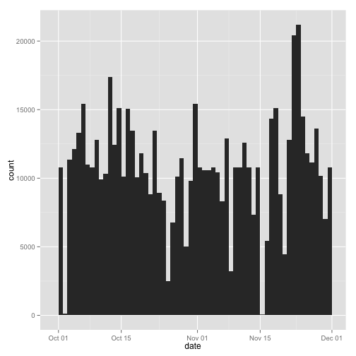
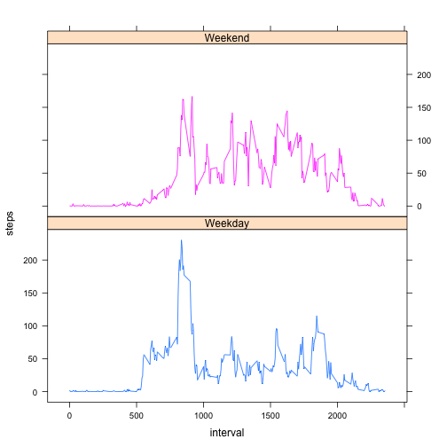

Reproducible Research Peer Assessment 1
---------------------------------------------

This first code chunk is dedicated to "loading and processing the data". It enables us to check if the file already exists in the working directory and, if not, download and read it then transform into a format suitable for analysis :


```r
if(file.exists("activity.csv")) {
  activity <- read.csv("activity.csv")
} else {
  if(!file.exists("activity.zip")) {
  download.file("https://d396qusza40orc.cloudfront.net/repdata%2Fdata%2Factivity.zip", destfile = "activity.zip", method="curl")
    }
  }
unzip("activity.zip")
activity <- read.csv("activity.csv")
activity$date <- as.Date(activity$date)
head(activity)
```

```
##   steps       date interval
## 1    NA 2012-10-01        0
## 2    NA 2012-10-01        5
## 3    NA 2012-10-01       10
## 4    NA 2012-10-01       15
## 5    NA 2012-10-01       20
## 6    NA 2012-10-01       25
```

```r
summary(activity)
```

```
##      steps            date               interval   
##  Min.   :  0.0   Min.   :2012-10-01   Min.   :   0  
##  1st Qu.:  0.0   1st Qu.:2012-10-16   1st Qu.: 589  
##  Median :  0.0   Median :2012-10-31   Median :1178  
##  Mean   : 37.4   Mean   :2012-10-31   Mean   :1178  
##  3rd Qu.: 12.0   3rd Qu.:2012-11-15   3rd Qu.:1766  
##  Max.   :806.0   Max.   :2012-11-30   Max.   :2355  
##  NA's   :2304
```

This second code chunk aims to make a histogram of the total number of steps taken each day, calculate and report the mean and median, while ignoring the missing values in the dataset.


```r
library(ggplot2)
plot1 <- qplot(date, weight=activity$steps, data=activity, geom="histogram", binwidth = 1)
print(plot1)
```

 

```r
mean(tapply(activity$steps, activity$date, sum, na.rm = TRUE))
```

```
## [1] 9354
```

```r
median(tapply(activity$steps, activity$date, sum, na.rm = TRUE))
```

```
## [1] 10395
```

This third code chunk produces a plot of the 5-minute interval and the average number of steps taken and highlight the 5-minute interval that, on average across all the days in the dataset, contains the maximum number of steps.


```r
mean.steps <- data.frame(cbind(activity$interval,tapply(activity$steps, activity$interval, mean, na.rm = TRUE)))
colnames(mean.steps) <- c("interval","steps")
plot2 <- ggplot(data=mean.steps,aes(x=interval,y=steps)) +
  geom_line()
print(plot2)
```

 

```r
max.steps <- mean.steps[which.max(mean.steps$steps),"interval"]
strftime(as.POSIXct(Sys.Date()) + as.difftime(round(max.steps/100), units="hours") + as.difftime(max.steps%%100, units="mins"), "%r",tz="UTC")
```

```
## [1] "08:35:00 AM"
```

This fourth code chunck cover the "imputing missing values" part of the assignment by calculating and reporting the total number of missing values, filling in all the missing data, creating a new dataset with them, making a histogram of the total number of steps taken each day and looking at the difference between the summary values of this new dataset and those of the original one


```r
sum(is.na(activity$steps))
```

```
## [1] 2304
```

```r
completed.activity <- activity
completed.activity[is.na(completed.activity[, 1]), 1] <- mean.steps[is.na(completed.activity[, 1]),2]

qplot(date, weight=completed.activity$steps, data=completed.activity, geom="histogram", binwidth = 1)
```

 

```r
mean(tapply(completed.activity$steps, completed.activity$date, sum, na.rm = TRUE))
```

```
## [1] 10766
```

```r
median(tapply(completed.activity$steps, completed.activity$date, sum, na.rm = TRUE))
```

```
## [1] 10766
```

We can here clearly see that inputing averaged values instead of missing one centered the distribution towards the median instead of being pulled down.

Last, this code chunck use the new dataset with filled in values to make a panel plot containing a time series plot of the 5-minute interval and the average number of step taken, averaged across all weekday days and weekend days.


```r
library(lattice)
completed.activity$day <- as.factor(ifelse(weekdays(completed.activity$date) %in% c("Saturday","Sunday"),"Weekend","Weekday"))
xyplot(steps ~ interval | day, aggregate(steps ~ interval + day, completed.activity, FUN = mean), layout = c(1, 2), type = "l", group=day)
```

 
